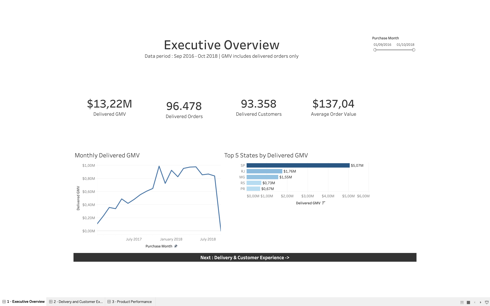
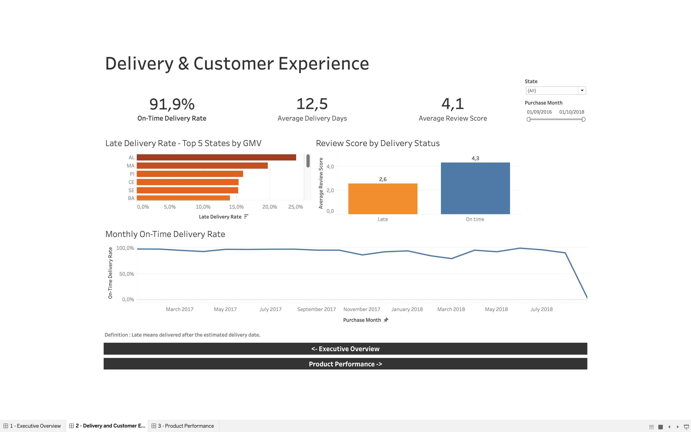
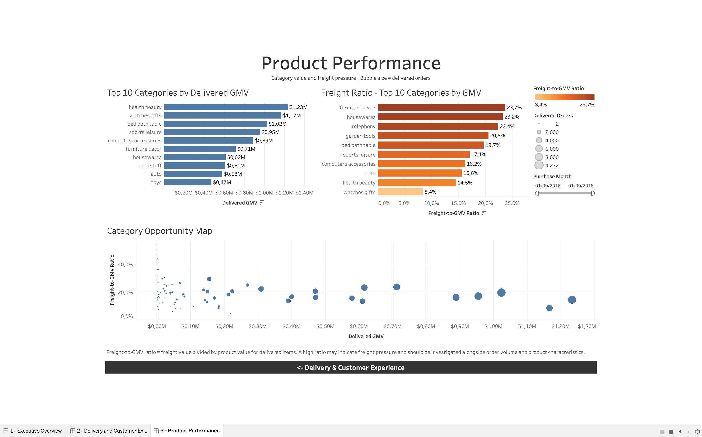

# Olist E-Commerce Analytics

## About This Project

I built this project to practise the full business intelligence workflow using a real e-commerce dataset. I started with raw CSV files, checked and transformed the data using DuckDB and SQL, and then created three dashboards in Tableau Public.

The analysis focuses on three areas:

- Sales performance and customer reach
- Delivery performance and customer reviews
- Product category performance and freight costs

## View the Dashboard

[Explore the interactive Tableau dashboard](https://public.tableau.com/views/olist_ecommerce_analytics_17882571819230/1-ExecutiveOverview?:language=en-GB&:display_count=n&:origin=viz_share_link)

## Dashboard Preview

### Executive Overview

This dashboard provides a quick view of delivered GMV, order volume, customer reach, average order value, monthly performance, and the leading states by GMV.

### Delivery and Customer Experience

This dashboard looks at delivery speed, late deliveries, on-time performance, and the difference in review scores between late and on-time orders.

### Product Performance

This dashboard compares product categories by delivered GMV, freight-to-GMV ratio, and delivered order volume.

## Questions I Wanted to Answer

- How did delivered GMV change over time?
- Which states contributed the most delivered GMV?
- How many delivered orders arrived on time?
- Did late deliveries receive lower customer reviews?
- Which product categories generated the most value?
- Which categories had relatively high freight costs?

## What I Found

### Sales were concentrated in São Paulo

Delivered orders generated approximately **$13.22M in GMV**. São Paulo contributed around **$5.07M**, or approximately **38% of the total**.

This makes São Paulo the largest market in the dataset, but it also shows that overall performance depends heavily on one state.

### Delivery performance was closely connected to customer reviews

Approximately **91.9% of delivered orders arrived on time**.

On-time orders received an average review score of **4.3**, while late orders received only **2.6**. This suggests that delivery reliability has a meaningful relationship with customer satisfaction.

### Some categories faced greater freight pressure

Freight costs were not distributed evenly across product categories. Among the leading categories by GMV, **furniture décor** had a freight-to-GMV ratio of approximately **23.7%**, followed by **housewares at 23.2%**.

These categories may require a closer look at packaging, shipping methods, product size, and logistics partners.

## Recommendations

- Maintain strong sales and delivery performance in São Paulo while looking for opportunities to grow in other states.
- Investigate the states and periods with the highest late-delivery rates.
- Work with logistics partners to address recurring delivery problems.
- Review packaging and shipping strategies for categories with high freight-to-GMV ratios.
- Continue monitoring delivery performance because it appears closely connected to customer reviews.

## How I Built It

The project follows this workflow:

1. Download the required Olist CSV files.
2. Load the files into DuckDB.
3. Run SQL quality checks for duplicates, missing values, and unmatched records.
4. Create separate datasets for order-level and item-level analysis.
5. Export the processed data for Tableau.
6. Build the worksheets and combine them into three dashboards.
7. Review the results and document the main findings.

## Data Model

I created two main analytical tables:

- **`mart_orders`** — one row per order, used for sales, customer, delivery, and review analysis.
- **`mart_sales`** — one row per order item, used for product category and freight analysis.

Using two tables helped prevent order values from being counted more than once when an order contained multiple products.

## KPI Definitions

- **Delivered GMV:** Product value from delivered orders.
- **Delivered Orders:** Number of distinct orders with a delivered status.
- **Delivered Customers:** Number of unique customers with delivered orders.
- **Average Order Value:** Delivered GMV divided by delivered orders.
- **On-Time Delivery Rate:** Percentage of delivered orders that arrived on or before the estimated delivery date.
- **Freight-to-GMV Ratio:** Delivered freight value divided by delivered product value.

## Tools Used

- **DuckDB** for storing and querying the data
- **SQL** for data checks, transformation, and analysis
- **Tableau Public** for visualization and dashboard creation
- **GitHub** for documentation and version control
- **VS Code** for writing and organizing the SQL files

## Dataset

This project uses the [Brazilian E-Commerce Public Dataset by Olist](https://www.kaggle.com/datasets/olistbr/brazilian-ecommerce).

The raw CSV files are not included in this repository. After downloading the required files from Kaggle, the SQL scripts can be run in numerical order to reproduce the project.

## Repository Structure

- `sql/` — SQL scripts used to load, check, transform, and export the data
- `analysis/` — KPI definitions, quality-check notes, and findings
- `dashboard/` — Tableau workbook information
- `images/` — dashboard screenshots
- `data/raw/` — instructions for downloading the source data
- `data/processed/` — processed datasets used in Tableau

## Limitations

- The dataset covers approximately September 2016 to October 2018 and includes partial years.
- GMV represents product value, not company revenue or profit.
- The dataset does not include detailed information about logistics costs, warehouse operations, or delivery partners.
- The analysis shows relationships in the data, but those relationships do not automatically prove cause and effect.

## About Me

I am Fernanda Adekeu Alif, and this project is part of my business intelligence portfolio. I enjoy working through the full process—from checking raw data to building dashboards and explaining what the results mean for a business.

[Connect with me on LinkedIn](https://www.linkedin.com/in/adekeu-alif/)